# SSH Server Hardening Lab

## Project Overview

This project is a practical Linux security lab focused on analyzing and hardening an Ubuntu Server, with particular attention to SSH security, firewall configuration, user privileges, and network exposure.

The lab was performed in a controlled VMware virtual environment using Kali Linux as the security testing machine and Ubuntu Server as the target server.

---

## Lab Environment

| Component | Role |
|---|---|
| Kali Linux | Security Testing / Network Assessment |
| Ubuntu Server | Server to be Hardened |
| VMware Workstation | Virtualization Platform |
| Network | Host-only / Isolated Lab Network |

### Network Configuration

- Kali Linux: `192.168.1.3`
- Ubuntu Server: `192.168.1.4`
- SSH Service: TCP/22

---

## Project Objectives

The main objectives of this lab were:

- Analyze the initial security posture of the Ubuntu Server
- Identify exposed network services
- Analyze listening ports
- Review the SSH configuration
- Review users and sudo privileges
- Configure and enable UFW
- Secure the SSH service
- Disable root login through SSH
- Configure SSH authentication securely
- Disable password-based SSH authentication
- Use SSH public-key authentication
- Verify the security improvements using Nmap

---

## 1. Initial Network Security Assessment

The first step was to perform a service and version scan against the Ubuntu Server using Nmap.

### Nmap Before Hardening

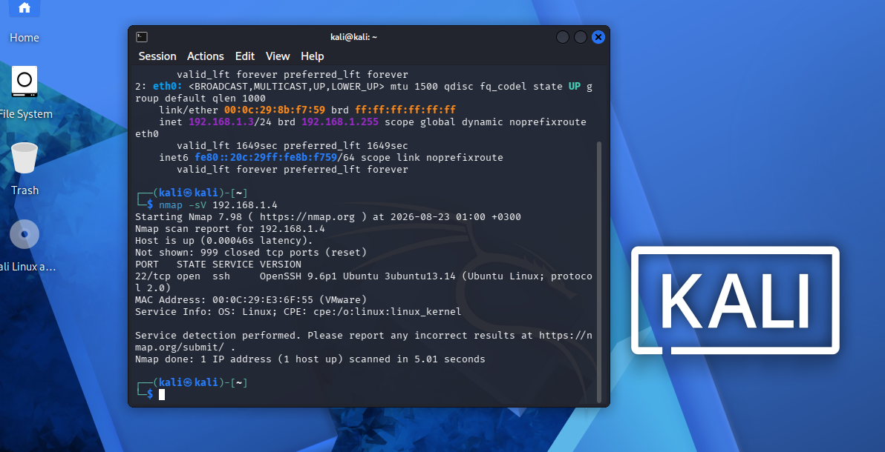

The scan confirmed that the server was reachable and that SSH was exposed on TCP port 22.

---

## 2. Firewall Analysis

The firewall configuration was checked before applying security rules.

### Firewall Before Hardening

The initial firewall state was reviewed before enabling UFW.

---

## 3. Listening Services Analysis

The active listening services were identified on the Ubuntu Server.

### Listening Services

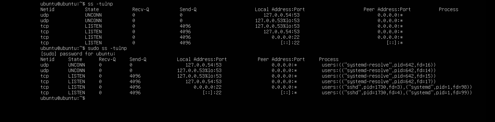

This step helped identify which services were listening for network connections.

---

## 4. SSH Service Analysis

The SSH service was inspected to verify its status and configuration.

### SSH Service

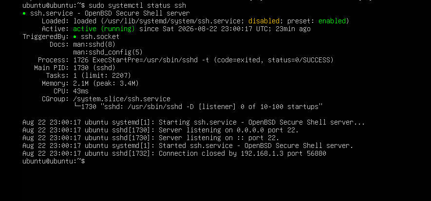

The SSH server was running and listening on TCP port 22.

---

## 5. SSH Configuration Review

The SSH server configuration was reviewed before applying hardening measures.

### SSH Configuration

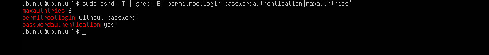

The configuration was analyzed to identify authentication and access-control settings that could be improved.

---

## 6. Users and Sudo Privileges

The local users and sudo privileges were reviewed as part of the server security assessment.

### Users and Sudo

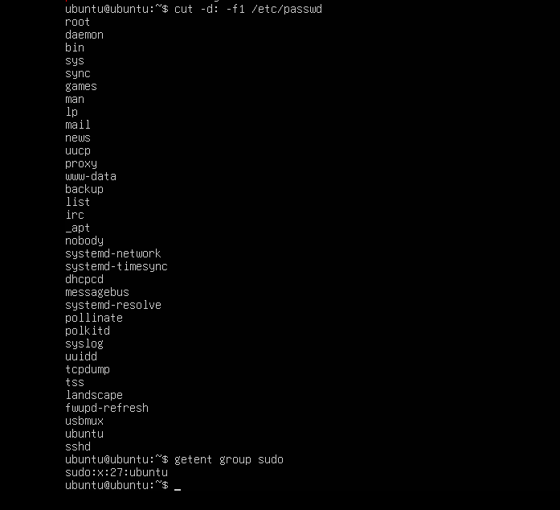

### Sudo Privileges

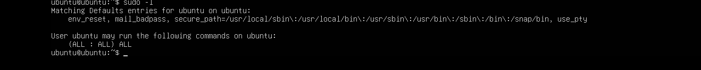

This helped verify which accounts had administrative privileges.

---

## 7. UFW Firewall Configuration

UFW was enabled and SSH access was explicitly allowed.

### UFW Enabled and SSH Allowed

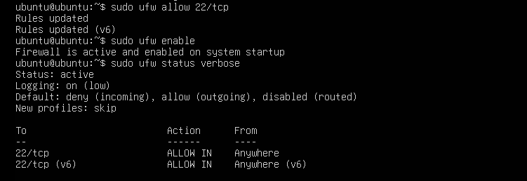

The firewall was configured with a default deny policy for incoming connections while allowing SSH access.

---

## 8. Network Verification After Firewall Configuration

Nmap was used again to verify the server after applying the firewall configuration.

### Nmap After UFW

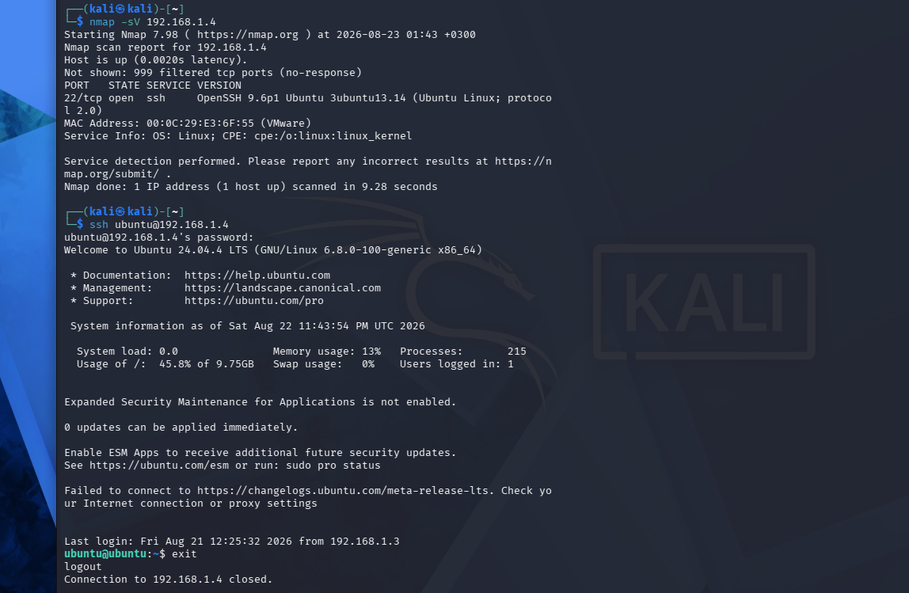

The result was compared with the initial scan to evaluate the effect of the firewall.

---

## 9. SSH Hardening

SSH security settings were modified to strengthen authentication and reduce unauthorized access risks.

### SSH Hardening Applied

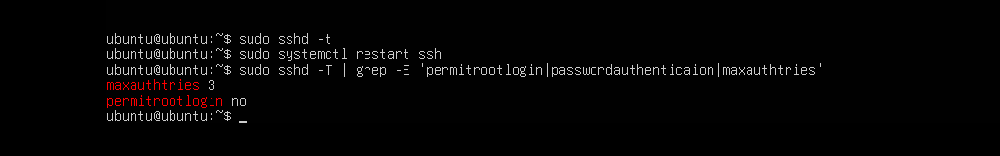

The SSH service was restarted and the configuration was validated after applying the changes.

---

## 10. SSH Hardening Verification

Nmap was used to verify the SSH service after hardening.

### Nmap After SSH Hardening

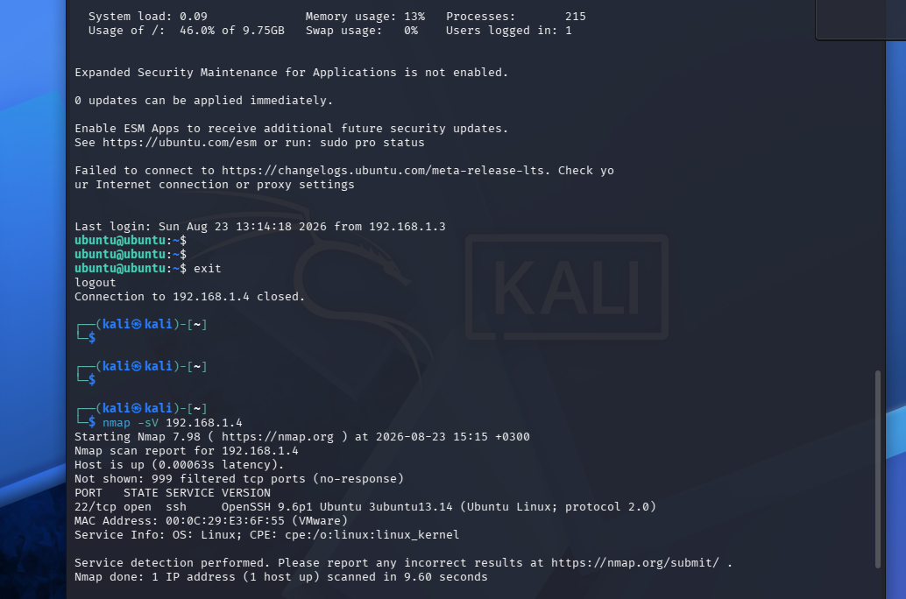

### Final Nmap Scan

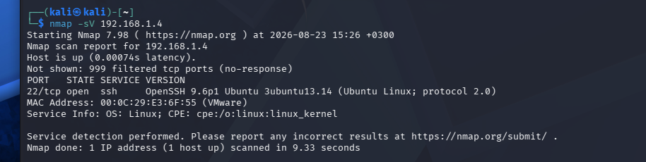

The final scan confirmed the resulting network exposure of the server.

---

## 11. Password Authentication Test

Password-based SSH authentication was tested after the hardening configuration.

### Password Login Blocked

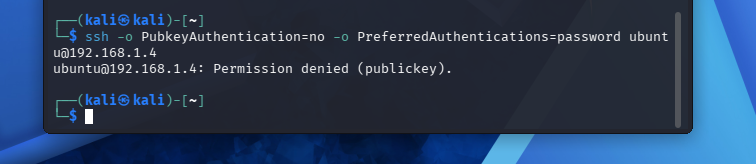

The test demonstrated that password-based SSH authentication was no longer accepted.

---

## 12. Final SSH Security Configuration

The final SSH configuration was reviewed to confirm that the intended security settings were active.

### Final SSH Hardening

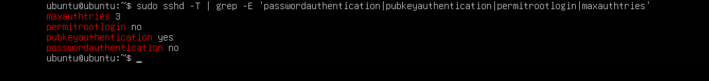

---

## Security Improvements

The following security measures were implemented:

- UFW firewall enabled
- Incoming traffic restricted by firewall policy
- SSH access controlled through TCP port 22
- Root SSH login disabled
- SSH authentication settings hardened
- Password-based SSH authentication disabled
- Public-key authentication configured
- SSH configuration validated after changes
- Network exposure verified using Nmap

---

## Tools Used

- Kali Linux
- Ubuntu Server
- Nmap
- OpenSSH
- UFW
- Linux command line
- VMware Workstation

---

## Skills Demonstrated

- Linux System Administration
- Network Configuration
- Network Security Assessment
- Nmap Network Scanning
- SSH Administration
- SSH Hardening
- Firewall Configuration
- User and Sudo Management
- Authentication Security
- Security Verification

---

## Conclusion

This lab provided practical experience in securing a Linux server by combining network assessment, firewall configuration, SSH hardening, authentication security, and post-configuration verification.

The project also strengthened practical skills in Linux administration, networking, and security assessment within an isolated virtual environment.
